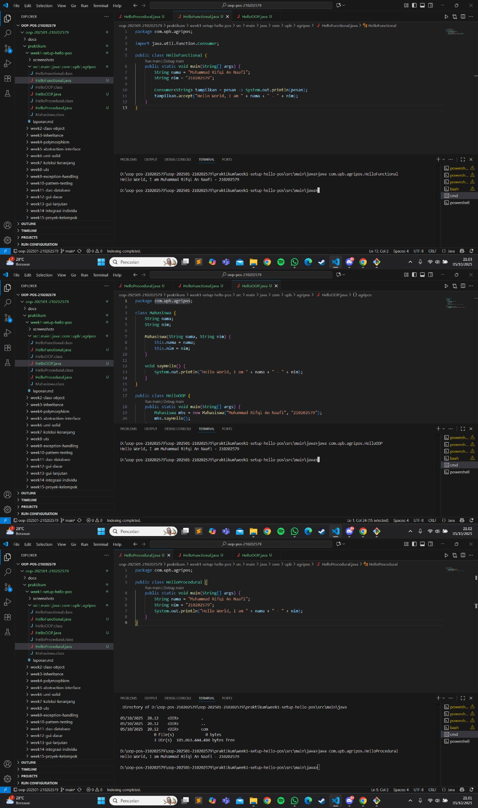

# Laporan Praktikum Minggu 1
Topik: Paradigma Pemrograman dan Setup Project

## Identitas
- Nama  : Muhammad Rifqi An Naafi
- NIM   : 210202579
- Kelas : 3IKKA

---

## Tujuan
Mahasiswa mampu memahami dan membedakan paradigma pemrograman prosedural, OOP (Object-Oriented Programming), dan fungsional.  
Selain itu, mahasiswa dapat mengimplementasikan program sederhana “Hello World” menggunakan ketiga paradigma tersebut.

---

## Dasar Teori
1. *Paradigma Prosedural*: Program dibangun dari serangkaian langkah atau instruksi yang dieksekusi secara berurutan.  
2. *Paradigma OOP (Object-Oriented Programming)*: Program dibangun dari objek yang memiliki atribut (data) dan method (perilaku).  
3. *Paradigma Fungsional: Pendekatan berbasis fungsi dan ekspresi, menggunakan konsep *lambda atau stream.  
4. Setiap paradigma memiliki kelebihan dan kekurangan tergantung kompleksitas dan kebutuhan sistem.  
5. OOP memudahkan pengembangan aplikasi besar seperti POS karena struktur dan modularitasnya yang tinggi.

---

## Langkah Praktikum
1. Membuat folder proyek oop-pos-210202579 dan inisialisasi repository Git.  
2. Membuat struktur folder praktikum/week1-setup-hello-pos/src/main/java/com/upb/agripos/.  
3. Membuat tiga file Java:  
   - HelloProcedural.java  
   - HelloOOP.java  
   - HelloFunctional.java  
4. Melakukan kompilasi program menggunakan javac, dan menjalankan program dengan java.  
5. Mengambil screenshot hasil eksekusi dan menyimpannya di praktikum/week1-setup-hello-pos/screenshots/hasil.png.  
6. Melakukan commit dengan pesan :week1-setup-hello-pos

---

## Kode Program

## 1. HelloProcedural.java
package com.upb.agripos;

public class HelloProcedural {
 public static void main(String[] args) {
     String nama = "Muhammad Rifqi An Naafi";
     String nim = "210202579";
     System.out.println("Hello World, I am " + nama + " - " + nim);
 }
}

## 2. HelloOOP.java
package com.upb.agripos;

class Mahasiswa {
    String nama;
    String nim;

    Mahasiswa(String nama, String nim) {
        this.nama = nama;
        this.nim = nim;
    }

    void sapa() {
        System.out.println("Hello World, I am " + nama + " - " + nim);
    }
}

public class HelloOOP {
    public static void main(String[] args) {
        Mahasiswa m = new Mahasiswa("Muhammad Rifqi An Naafi", "210202579");
        m.sapa();
    }
}
	
## 3. HelloFunctional.java
package com.upb.agripos;

import java.util.function.Consumer;

public class HelloFunctional {
    public static void main(String[] args) {
        String nama = "Muhammad Rifqi An Naafi";
        String nim = "210202579";

        Consumer<String> tampilkan = pesan -> System.out.println(pesan);
        tampilkan.accept("Hello World, I am " + nama + " - " + nim);
    }
}

---
## Hasil Eksekusi

---

## Analisis
- Cara kerja kode :
•	Paradigma prosedural menjalankan instruksi secara langsung.
•	Paradigma OOP menggunakan class dan object untuk mengatur struktur program.
•	Paradigma fungsional memakai fungsi lambda untuk mencetak hasil tanpa banyak boilerplate.
-  Perbedaan :
OOP dan fungsional lebih modular dan mudah dikembangkan dibanding prosedural.
-  Kendala :
Saat menjalankan program di terminal terjadi error “Could not find or load main class”, penyebabnya karena menjalankan class dari direktori yang salah. Solusinya: jalankan perintah dari root proyek (oop-pos-210202579) dengan menyertakan nama package penuh:
java com.upb.agripos.HelloProcedural

---

## Kesimpulan
Dengan memahami tiga paradigma pemrograman, mahasiswa dapat menentukan pendekatan terbaik untuk menyelesaikan masalah.
OOP lebih cocok untuk aplikasi besar karena modular dan mudah dipelihara, sedangkan fungsional membantu mengurangi kode berulang.

---

## Quizz
1.  Apakah OOP selalu lebih baik dari prosedural?
Jawaban: Tidak selalu. Untuk program kecil, prosedural lebih sederhana dan efisien. Namun, OOP unggul untuk sistem besar dan kompleks.
2.  Kapan functional programming lebih cocok digunakan dibanding OOP atau prosedural?
Jawaban: Functional lebih cocok saat memproses data besar atau ketika dibutuhkan operasi paralel seperti di data stream processing.
3.  Bagaimana paradigma (prosedural, OOP, fungsional) memengaruhi maintainability dan scalability aplikasi?
Jawaban: OOP dan fungsional lebih mudah dirawat dan dikembangkan dibanding prosedural karena struktur kode lebih modular.
4.  Mengapa OOP lebih cocok untuk mengembangkan aplikasi POS dibanding prosedural?
Jawaban: Karena OOP dapat memodelkan entitas seperti Produk, Transaksi, dan Pembayaran sebagai objek sehingga kode lebih terorganisir.
5. Bagaimana paradigma fungsional dapat membantu mengurangi kode berulang (boilerplate code)?
Jawaban: Dengan memanfaatkan fungsi lambda dan ekspresi, fungsional memungkinkan kode lebih ringkas dan reusable.