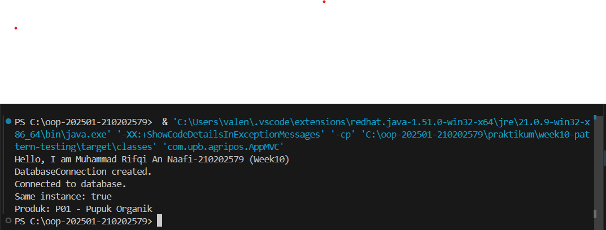

# Laporan Praktikum Minggu 10  
Topik: Design Pattern (Singleton, MVC) dan Unit Testing dengan JUnit

## Identitas
- Nama  : Muhammad Rifqi An Naafi  
- NIM   : 210202579  
- Kelas : 3IKKA  

---

## Tujuan
Mahasiswa mampu memahami konsep design pattern (Singleton dan MVC), mengimplementasikannya dalam aplikasi sederhana, serta membuat dan menjalankan unit test menggunakan JUnit.

---

## Dasar Teori
1. Design Pattern adalah solusi umum yang dapat digunakan kembali untuk permasalahan desain perangkat lunak.  
2. Singleton Pattern memastikan hanya ada satu instance dari suatu class.  
3. MVC (Model–View–Controller) memisahkan logika bisnis, tampilan, dan kontrol aplikasi.  
4. Unit Testing digunakan untuk menguji fungsi secara terpisah.  
5. JUnit adalah framework testing standar pada Java.

---

## Langkah Praktikum
1. Membuat package `model`, `view`, `controller`, dan `config`.  
2. Mengimplementasikan Singleton pada class `DatabaseConnection`.  
3. Membuat struktur MVC:
   - Model: `Product`
   - View: `ConsoleView`
   - Controller: `ProductController`  
4. Mengintegrasikan semuanya dalam `AppMVC`.  
5. Membuat unit test `ProductTest` menggunakan JUnit.  
6. Menjalankan unit test dan mengambil screenshot hasil.  
7. Melakukan commit dengan pesan:  
   `week10-pattern-testing: implement singleton, mvc, and junit test`

---

## Kode Program
Contoh potongan kode Singleton:

```java
public static DatabaseConnection getInstance() {
    if (instance == null) {
        instance = new DatabaseConnection();
    }
    return instance;
}
```

Contoh potongan kode MVC:
```java
controller.showProduct();
```

Contoh unit test:
```java
@Test
public void testProductName() {
    Product p = new Product("P01", "Benih Jagung");
    assertEquals("Benih Jagung", p.getName());
}
```

---

## Hasil Eksekusi


---

## Analisis
- Singleton memastikan hanya ada satu objek koneksi database.
- MVC memisahkan tanggung jawab program sehingga kode lebih terstruktur dan mudah dirawat.
- Unit testing memastikan setiap method berjalan sesuai yang diharapkan sebelum aplikasi digunakan.
- Dibandingkan minggu sebelumnya, fokus kini pada kualitas desain dan keandalan kode.

---

## Kesimpulan
Penerapan design pattern dan unit testing meningkatkan kualitas perangkat lunak. Singleton mencegah duplikasi instance penting, MVC membuat arsitektur lebih rapi, dan JUnit membantu mendeteksi kesalahan sejak awal.

---

## Quiz
1. Mengapa constructor pada Singleton harus bersifat private?
Jawaban:
Agar objek tidak bisa dibuat langsung dari luar class sehingga hanya satu instance yang dapat dibuat melalui method getInstance().

2. Jelaskan manfaat pemisahan Model, View, dan Controller.
Jawaban:
Agar logika bisnis, tampilan, dan kontrol terpisah sehingga program lebih terstruktur, mudah dipelihara, dan mudah dikembangkan.

3. Apa peran unit testing dalam menjaga kualitas perangkat lunak?
Jawaban:
Unit testing memastikan setiap fungsi berjalan benar dan membantu mendeteksi bug lebih awal.

4. Apa risiko jika Singleton tidak diimplementasikan dengan benar?
Jawaban:
Dapat terjadi lebih dari satu instance sehingga menimbulkan inkonsistensi data dan pemborosan sumber daya.