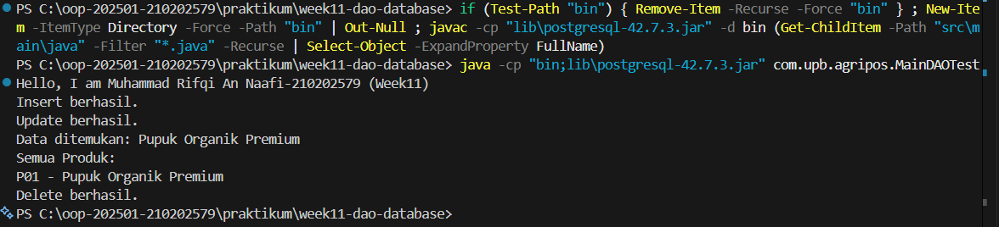

# Laporan Praktikum Minggu 11

Topik: Data Access Object (DAO) dan CRUD Database dengan JDBC

## Identitas

- Nama : Muhammad Rifqi An Naafi
- NIM : 210202579
- Kelas : 3IKKA

---

## Tujuan

Mahasiswa mampu memahami konsep Data Access Object (DAO), menghubungkan aplikasi Java dengan database PostgreSQL menggunakan JDBC, serta mengimplementasikan operasi CRUD (Create, Read, Update, Delete) pada aplikasi OOP.

---

## Dasar Teori

1. DAO (Data Access Object) memisahkan logika akses database dari logika bisnis aplikasi.
2. JDBC digunakan sebagai penghubung antara aplikasi Java dan database relasional.
3. CRUD terdiri dari operasi Create, Read, Update, dan Delete.
4. PreparedStatement digunakan untuk meningkatkan keamanan dan efisiensi query.
5. ResultSet digunakan untuk membaca hasil query dari database.

---

## Langkah Praktikum

1. Menginstal PostgreSQL dan pgAdmin, kemudian membuat database `agripos`.
2. Membuat tabel `products` dengan field code, name, price, dan stock.
3. Menambahkan JDBC Driver PostgreSQL ke project Java.
4. Membuat class `Product` sebagai model.
5. Membuat interface `ProductDAO` dan implementasinya `ProductDAOImpl`.
6. Membuat class `MainDAOTest` untuk menguji operasi CRUD.
7. Menjalankan program dan memastikan insert, update, select, dan delete berjalan.
8. Commit dan push dengan message:  
   `week11-dao-database: implement CRUD product with JDBC`

---

## Kode Program

Contoh kode utama pada `MainDAOTest`:

```java
Connection conn = DriverManager.getConnection(
    "jdbc:postgresql://localhost:5432/agripos",
    "postgres",
    "password"
);

ProductDAO dao = new ProductDAOImpl(conn);

dao.insert(new Product("P01", "Pupuk Organik", 25000, 10));
dao.update(new Product("P01", "Pupuk Organik Premium", 30000, 8));

Product p = dao.findByCode("P01");
System.out.println(p.getName());

dao.delete("P01");
conn.close();
```

---

## Hasil Eksekusi



---

## Analisis

- Program menggunakan pola DAO sehingga logika database terpisah dari logika aplikasi.
- Berbeda dengan minggu sebelumnya yang hanya menggunakan collection di memori, minggu ini data disimpan secara permanen di database.
- Kendala utama adalah error JDBC driver, yang diatasi dengan menambahkan library PostgreSQL JDBC ke project.

---

## Kesimpulan
Dengan penerapan DAO dan JDBC, aplikasi Java dapat terhubung dengan database secara terstruktur dan aman. Operasi CRUD dapat dilakukan dengan rapi, mudah dipelihara, dan sesuai dengan prinsip desain OOP.

---

## Quiz
1. Apa itu DAO dan apa manfaatnya?
Jawaban: DAO adalah pola desain untuk memisahkan logika akses database dari logika bisnis agar kode lebih terstruktur dan mudah dipelihara.

2. Mengapa menggunakan PreparedStatement?
Jawaban: Untuk mencegah SQL Injection dan meningkatkan efisiensi_toggle eksekusi query.

3. Apa fungsi JDBC dalam aplikasi Java?
Jawaban: JDBC berfungsi sebagai penghubung antara aplikasi Java dan database relasional untuk menjalankan perintah SQL.
