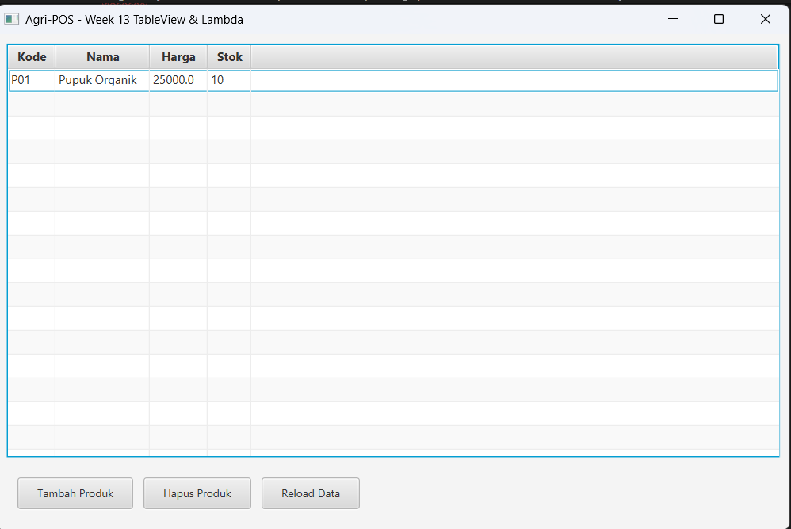

# Laporan Praktikum Minggu 13

Topik: GUI Lanjutan JavaFX (TableView dan Lambda Expression)

## Identitas
- Nama : Muhammad Rifqi An Naafi
- NIM : 210202579
- Kelas : 3IKKA

---

## Tujuan

Mahasiswa mampu menampilkan data produk menggunakan TableView JavaFX, mengintegrasikan GUI dengan DAO melalui ProductService, serta menerapkan lambda expression untuk event handling pada operasi tambah dan hapus data.

---

## Dasar Teori
1. TableView adalah komponen JavaFX untuk menampilkan data dalam bentuk tabel.
2. ObservableList digunakan agar perubahan data langsung tercermin pada UI.
3. Lambda Expression mempersingkat penulisan event handler.
4. Arsitektur MVC memisahkan View, Controller, Service, dan DAO.
5. DAO bertugas berkomunikasi langsung dengan database PostgreSQL.

---

## Langkah Praktikum
1. Melanjutkan project dari Week 12 (GUI dasar).
2. Mengganti ListView/TextArea menjadi TableView<Product>.
3. Menghubungkan TableView dengan method findAll() pada ProductService.
4. Menambahkan tombol Hapus Produk dengan lambda expression.
5. Menguji fitur tambah dan hapus produk.
6. Memastikan perubahan tersimpan di PostgreSQL.
7. Mengambil screenshot GUI dan commit ke Git.
8. Commit message:
week13-gui-lanjutan: tableview load & delete product with lambda

---

## Kode Program
Contoh kode utama (event handler hapus dan load data):
```java
btnDelete.setOnAction(e -> {
    Product selected = table.getSelectionModel().getSelectedItem();
    if (selected != null) {
        productService.delete(selected.getCode());
        loadData();
    }
});

public void loadData() {
    List<Product> list = productService.findAll();
    table.setItems(FXCollections.observableArrayList(list));
}
```
---

## Hasil Eksekusi
Screenshot GUI saat TableView menampilkan data produk dan setelah proses hapus:


---

## Analisis
1. Data produk ditampilkan menggunakan TableView yang terhubung ke ProductService.
2. Event tombol menggunakan lambda expression sehingga kode lebih ringkas.
3. Alur akses data mengikuti pola MVC:
View → Controller → Service → DAO → Database.
4. Kendala yang dialami adalah konfigurasi JavaFX dan JDBC driver, yang diselesaikan dengan menambahkan library JavaFX dan PostgreSQL Driver pada classpath.

---

## Tabel Traceability Bab 6
| Artefak Bab 6 | Referensi          | Handler GUI  | Controller/Service                                   | DAO                  | Dampak UI/DB             |
| ------------- | ------------------ | ------------ | ---------------------------------------------------- | -------------------- | ------------------------ |
| Use Case      | UC-02 Lihat Produk | loadData()   | ProductController.load() → ProductService.findAll()  | ProductDAO.findAll() | TableView terisi dari DB |
| Use Case      | UC-03 Hapus Produk | Tombol Hapus | ProductController.delete() → ProductService.delete() | ProductDAO.delete()  | Data terhapus di DB & UI |
| Sequence      | SD-02 Hapus Produk | Tombol Hapus | View → Controller → Service                          | DAO → DB             | Urutan sesuai diagram    |

---

## Kesimpulan
Pada praktikum Minggu 13, mahasiswa berhasil membangun GUI JavaFX lanjutan menggunakan TableView dan lambda expression, serta mengintegrasikannya dengan backend DAO berbasis PostgreSQL. Arsitektur MVC dan prinsip SOLID tetap terjaga, sehingga aplikasi Agri-POS siap dikembangkan lebih lanjut pada tahap berikutnya.