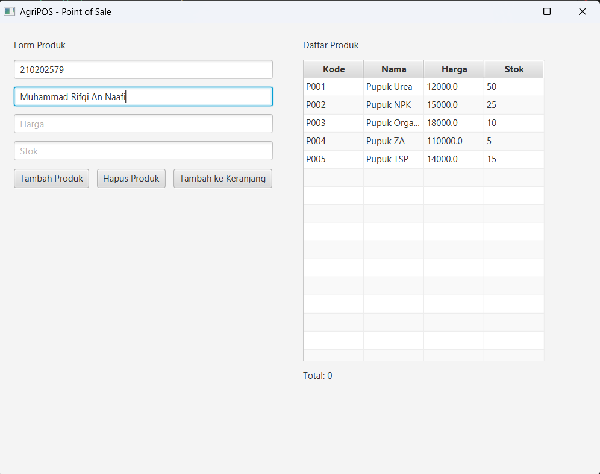

# Laporan Praktikum Minggu 14  
Topik: Integrasi OOP, Database, dan GUI (Agri-POS JavaFX)

## Identitas
- Nama  : Muhammad Rifqi An Naafi  
- NIM   : 210202579  
- Kelas : [Isi sesuai kelas Anda]

---

## Tujuan
Mahasiswa mampu mengintegrasikan seluruh konsep OOP, UML, SOLID, DAO, JDBC, Collections, Exception Handling, Design Pattern, Unit Testing, dan JavaFX ke dalam satu aplikasi kasir sederhana (Agri-POS) yang berjalan end-to-end.

---

## Dasar Teori
1. OOP (Object Oriented Programming) memodelkan sistem dalam bentuk class dan objek.
2. DAO (Data Access Object) memisahkan logika akses database dari logika bisnis.
3. JavaFX digunakan untuk membangun aplikasi GUI berbasis event-driven.
4. MVC memisahkan View, Controller, dan Model agar sistem terstruktur.
5. SOLID (khususnya DIP) memastikan View tidak bergantung langsung pada DAO.

---

## Langkah Praktikum
1. Menyiapkan database PostgreSQL dan tabel `products`.
2. Membuat struktur project Java sesuai arsitektur MVC + Service + DAO.
3. Mengimplementasikan:
   - Model: Product, Cart, CartItem
   - DAO: ProductDAO, JdbcProductDAO
   - Service: ProductService, CartService
   - Controller: PosController
   - View: PosView (JavaFX)
4. Menghubungkan GUI JavaFX dengan database melalui Service dan DAO.
5. Menambahkan validasi menggunakan exception.
6. Menjalankan aplikasi melalui `AppJavaFX`.
7. Melakukan pengujian unit menggunakan JUnit pada `CartServiceTest`.
8. Commit message:
week14-integrasi-individu: integrasi OOP, DAO, Cart, JavaFX, dan Testing


---

## Kode Program
Contoh kode utama pada event Tambah Produk:

```java
btnAdd.setOnAction(e -> {
    Product p = new Product(
        txtCode.getText(),
        txtName.getText(),
        Double.parseDouble(txtPrice.getText()),
        Integer.parseInt(txtStock.getText())
    );
    productService.addProduct(p);
    tableView.getItems().add(p);
});
```
---

## Hasil Eksekusi


---

## Analisis
1. Program berjalan dengan alur: View → Controller → Service → DAO → Database.
2. Dibanding minggu sebelumnya, minggu ini mengintegrasikan seluruh modul (OOP, DB, GUI, Collections, Testing).
3. Kendala:
- Error koneksi JDBC → diselesaikan dengan menambahkan driver PostgreSQL.
- JavaFX tidak terdeteksi → diselesaikan dengan konfigurasi VM Options dan library.

--- 

## Tabel Traceability Bab 6 

| Artefak | Referensi | Handler | Controller/Service | DAO | Dampak |
|----------|-----------|---------|--------------------|-----|--------|
| Use Case | UC-01 Tambah Produk | Tombol Tambah | PosController.addProduct() → ProductService.insert() | ProductDAO.insert() | DB insert + TableView reload |
| Use Case | UC-02 Hapus Produk | Tombol Hapus | PosController.deleteProduct() → ProductService.delete() | ProductDAO.delete() | DB delete + UI update |
| Activity | AD-01 Tambah Keranjang | Tombol Add to Cart | PosController.addToCart() → CartService.addItem() | - | Total belanja berubah |
| Sequence | SD-01 CRUD Produk | Event GUI | View → Controller → Service | DAO → DB | Alur sesuai diagram |

---

## Kesimpulan
Aplikasi Agri-POS berhasil mengintegrasikan seluruh materi dari Bab 1 sampai Bab 14, menerapkan arsitektur berlapis (MVC, Service, DAO), prinsip SOLID, serta GUI berbasis JavaFX yang terhubung ke database PostgreSQL secara end-to-end.
