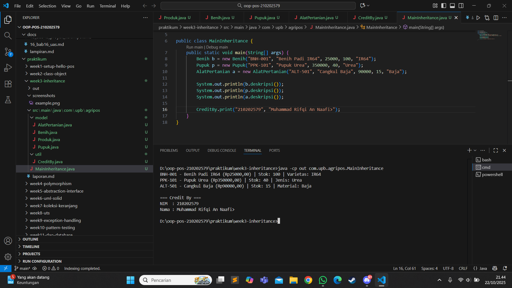

# Laporan Praktikum Minggu 3
Topik: Inheritance (Kategori Produk)

## Identitas
- Nama  : Muhammad Rifqi An Naafi
- NIM   : 210202579
- Kelas : 3IKKA

---

## Tujuan
Mahasiswa mampu menjelaskan konsep inheritance (pewarisan class) dalam OOP,  
mampu membuat superclass dan subclass untuk produk pertanian,  
serta dapat mendemonstrasikan hierarki class menggunakan keyword super.

---

## Dasar Teori
1. *Inheritance* adalah konsep dalam OOP yang memungkinkan suatu class mewarisi atribut dan method dari class lain.  
2. *Superclass* adalah class induk yang berisi atribut umum.  
3. *Subclass* adalah class turunan yang mewarisi atribut dan method dari superclass.  
4. Keyword **super** digunakan untuk memanggil konstruktor atau method milik superclass.  
5. Inheritance membuat kode lebih *efisien, reusable, dan mudah diperluas* dibanding class tunggal.

---

## Langkah Praktikum
1. Membuat class Produk sebagai superclass yang berisi atribut kode, nama, harga, dan stok.  
2. Membuat subclass:
   - Benih (atribut tambahan: varietas)  
   - Pupuk (atribut tambahan: jenis)  
   - AlatPertanian (atribut tambahan: material)
3. Menambahkan method deskripsi() di setiap subclass untuk menampilkan informasi lengkap produk.  
4. Membuat class CreditBy untuk menampilkan identitas mahasiswa.  
5. Membuat class MainInheritance untuk menjalankan program dan menampilkan hasilnya.  
6. Melakukan commit dengan pesan:  
git commit -m "week3-inheritance"

---

## Kode Program

Produk.java
package com.upb.agripos.model;

public class Produk {
    private String kode;
    private String nama;
    private double harga;
    private int stok;

    public Produk(String kode, String nama, double harga, int stok) {
        this.kode = kode;
        this.nama = nama;
        this.harga = harga;
        this.stok = stok;
    }

    // Getter dan Setter
    public String getKode() { return kode; }
    public String getNama() { return nama; }
    public double getHarga() { return harga; }
    public int getStok() { return stok; }

    public void setKode(String kode) { this.kode = kode; }
    public void setNama(String nama) { this.nama = nama; }
    public void setHarga(double harga) { this.harga = harga; }
    public void setStok(int stok) { this.stok = stok; }

    public String deskripsi() {
        return String.format("%s - %s (Rp%.2f) | Stok: %d", kode, nama, harga, stok);
    }
}

Benih.java
package com.upb.agripos.model;

public class Benih extends Produk {
    private String varietas;

    public Benih(String kode, String nama, double harga, int stok, String varietas) {
        super(kode, nama, harga, stok);
        this.varietas = varietas;
    }

    public String getVarietas() { return varietas; }
    public void setVarietas(String varietas) { this.varietas = varietas; }

    @Override
    public String deskripsi() {
        return super.deskripsi() + " | Varietas: " + varietas;
    }
}

Pupuk.java
package com.upb.agripos.model;

public class Pupuk extends Produk {
    private String jenis;

    public Pupuk(String kode, String nama, double harga, int stok, String jenis) {
        super(kode, nama, harga, stok);
        this.jenis = jenis;
    }

    public String getJenis() { return jenis; }
    public void setJenis(String jenis) { this.jenis = jenis; }

    @Override
    public String deskripsi() {
        return super.deskripsi() + " | Jenis: " + jenis;
    }
}

AlatPertanian.java
package com.upb.agripos.model;

public class AlatPertanian extends Produk {
    private String material;

    public AlatPertanian(String kode, String nama, double harga, int stok, String material) {
        super(kode, nama, harga, stok);
        this.material = material;
    }

    public String getMaterial() { return material; }
    public void setMaterial(String material) { this.material = material; }

    @Override
    public String deskripsi() {
        return super.deskripsi() + " | Material: " + material;
    }
}

CreditBy.java
package com.upb.agripos.util;

public class CreditBy {
    public static void print(String nim, String nama) {
        System.out.println("\n=== Credit By ===");
        System.out.println("NIM  : " + nim);
        System.out.println("Nama : " + nama);
    }
}

MainInheritance.java
package com.upb.agripos;

import com.upb.agripos.model.*;
import com.upb.agripos.util.CreditBy;

public class MainInheritance {
 public static void main(String[] args) {
     Benih b = new Benih("BNH-001", "Benih Padi IR64", 25000, 100, "IR64");
     Pupuk p = new Pupuk("PPK-101", "Pupuk Urea", 350000, 40, "Urea");
     AlatPertanian a = new AlatPertanian("ALT-501", "Cangkul Baja", 90000, 15, "Baja");

     System.out.println(b.deskripsi());
     System.out.println(p.deskripsi());
     System.out.println(a.deskripsi());

     CreditBy.print("210202579", "Muhammad Rifqi An Naafi");
 }
}

---

## Hasil Eksekusi

BNH-001 - Benih Padi IR64 (Rp25000.00) | Stok: 100 | Varietas: IR64
PPK-101 - Pupuk Urea (Rp350000.00) | Stok: 40 | Jenis: Urea
ALT-501 - Cangkul Baja (Rp90000.00) | Stok: 15 | Material: Baja

=== Credit By ===
NIM  : 210202579
Nama : Muhammad Rifqi An Naafi

---

## Analisis

- Program menggunakan konsep inheritance untuk menurunkan atribut dan method umum dari Produk ke subclass Benih, Pupuk, dan AlatPertanian.
- Dengan inheritance, setiap subclass tidak perlu menulis ulang atribut kode, nama, harga, dan stok.
- Penggunaan super() memungkinkan subclass memanggil konstruktor superclass untuk inisialisasi data umum.
- Dibanding minggu sebelumnya (tanpa inheritance), kode kini lebih singkat dan mudah dikembangkan.
- Tidak ada error saat kompilasi; kendala hanya pada struktur folder dan classpath yang harus sesuai dengan package.

---

## Kesimpulan
Dengan menerapkan inheritance, program menjadi lebih terstruktur, efisien, dan mudah dikelola.
Superclass Produk berfungsi sebagai dasar yang dapat digunakan kembali oleh berbagai subclass produk pertanian.
Konsep super memudahkan pemanggilan konstruktor dan method parent class secara langsung.

---

## Quiz
1. Apa keuntungan menggunakan inheritance dibanding membuat class terpisah tanpa hubungan?
Jawaban:
Dengan inheritance, kita dapat menghindari duplikasi kode karena atribut dan method umum cukup didefinisikan sekali di superclass, lalu diwariskan ke subclass.
Program menjadi lebih efisien, terstruktur, dan mudah dirawat.

2. Bagaimana cara subclass memanggil konstruktor superclass?
Jawaban:
Subclass memanggil konstruktor superclass menggunakan keyword super() di baris pertama konstruktor subclass.
Contoh:

public Pupuk(String kode, String nama, double harga, int stok, String jenis) {
    super(kode, nama, harga, stok);
    this.jenis = jenis;
}

3. Berikan contoh kasus di POS pertanian selain Benih, Pupuk, dan Alat Pertanian yang bisa dijadikan subclass.
Jawaban:
Beberapa contoh subclass lain:
Pestisida → atribut: bahanAktif, jenisHama
HasilPanen → atribut: tanggalPanen, berat, kualitas
ObatTanaman → atribut: dosis, caraPenggunaan
PeralatanIrigasi → atribut: kapasitas, tipePompa
Semua subclass tersebut tetap mewarisi atribut umum dari superclass Produk.