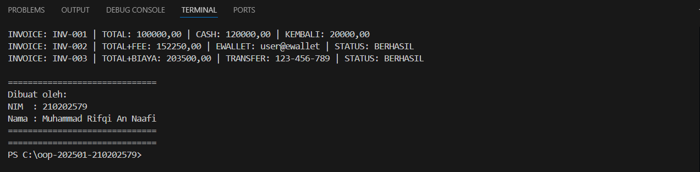

# Laporan Praktikum Minggu 1 (sesuaikan minggu ke berapa?)
Topik: Abstraction (Abstract Class & Interface)

## Identitas
- Nama  : Muhammad Rifqi An Naafi
- NIM   : 210202579
- Kelas : 3IKKA

---

## Tujuan
(Mahasiswa memahami konsep abstraksi dalam pemrograman berorientasi objek dengan menggunakan abstract class dan interface, serta mampu mengimplementasikan konsep tersebut untuk mendukung polimorfisme dan multiple inheritance pada Java.)

---

## Dasar Teori
(
   1. Abstraksi adalah proses menyederhanakan kompleksitas dengan menampilkan fitur penting dan menyembunyikan detail implementasi.
   2. Abstract class adalah class yang tidak dapat diinstansiasi dan dapat memiliki method abstrak maupun non-abstrak.
   3. Interface merupakan kumpulan kontrak method yang harus diimplementasikan oleh class.
   4. Java tidak mendukung multiple inheritance pada class, tetapi mendukungnya melalui interface.
   5. Abstract class cocok digunakan untuk shared state, sedangkan interface untuk mendefinisikan kemampuan.

)

---

## Langkah Praktikum
1. Membuat abstract class `Pembayaran` yang berisi field dan method abstrak.
2. Membuat class `Cash`, `EWallet`, dan `TransferBank` sebagai subclass dari `Pembayaran`.
3. Membuat interface `Validatable` dan `Receiptable`.
4. Mengimplementasikan interface pada class sesuai kebutuhan.
5. Membuat `MainAbstraction.java` untuk mendemonstrasikan polimorfisme.
6. Menjalankan program dan mendokumentasikan hasil eksekusi.
7. Melakukan commit dengan pesan: `week5-abstraction-interface`.

---

## Kode Program
(
```java
Pembayaran pembayaran1 = new Cash("INV-001", 100000, 120000);
Pembayaran pembayaran2 = new EWallet("INV-002", 150000, "user@ewallet", "123456");

System.out.println(((Receiptable) pembayaran1).cetakStruk());
System.out.println(((Receiptable) pembayaran2).cetakStruk());

```
)
---

## Hasil Eksekusi
( 

)
---

## Analisis
(
- Program berjalan dengan memanfaatkan abstract class Pembayaran sebagai tipe referensi.
- Setiap metode pembayaran memiliki implementasi berbeda melalui override method.
- Dibandingkan minggu sebelumnya, pendekatan minggu ini lebih fleksibel karena menggunakan abstraksi.
- Kendala yang dihadapi adalah memahami perbedaan abstract class dan interface, namun dapat diatasi dengan latihan implementasi langsung.
)
---

## Kesimpulan
(Dengan penerapan abstract class dan interface, program menjadi lebih fleksibel, terstruktur, serta mendukung pengembangan sistem secara scalable melalui polimorfisme dan multiple inheritance.)

---

## Quiz
(1. [Jelaskan perbedaan konsep dan penggunaan abstract class dan interface.]  
   **Jawaban:** Abstract class dapat memiliki atribut dan method konkret, sedangkan interface hanya berisi kontrak method. Abstract class digunakan untuk relasi “is-a” dengan shared state, sedangkan interface untuk mendefinisikan kemampuan.  

2. [Mengapa multiple inheritance lebih aman dilakukan dengan interface pada Java?]  
   **Jawaban:** Karena interface tidak memiliki state, sehingga tidak menimbulkan konflik pewarisan seperti pada multiple inheritance class.

3. [Pada contoh Agri-POS, bagian mana yang paling tepat menjadi abstract class dan mana yang menjadi interface? Jelaskan alasannya.]  
   **Jawaban:** Pembayaran tepat menjadi abstract class karena memiliki state dan perilaku umum, sedangkan Validatable dan Receiptable tepat menjadi interface karena mendefinisikan kemampuan yang dapat dimiliki oleh berbagai class.  )