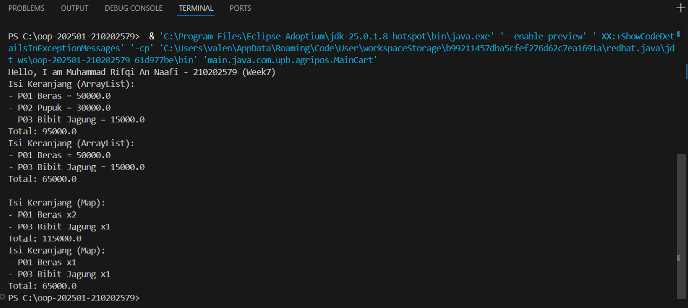

# Laporan Praktikum Minggu 7  
Topik: Collections dan Implementasi Keranjang Belanja (Agri-POS)

## Identitas
- Nama  : Muhammad Rifqi An Naafi  
- NIM   : 210202579  
- Kelas : 3IKKA  

---

## Tujuan
Mahasiswa memahami konsep Java Collections (List, Map, dan Set) serta mampu mengimplementasikan struktur data tersebut dalam studi kasus keranjang belanja Agri-POS untuk melakukan operasi tambah produk, hapus produk, dan menghitung total transaksi.

---

## Dasar Teori
1. Java Collections Framework menyediakan struktur data dinamis seperti List, Map, dan Set.  
2. List (ArrayList) menyimpan data secara terurut dan dapat memiliki duplikasi.  
3. Map (HashMap) menyimpan data dalam pasangan key–value.  
4. Set (HashSet) tidak mengizinkan data duplikat.  
5. Collections mempermudah pengelolaan data dalam aplikasi skala kecil hingga besar.

---

## Langkah Praktikum
1. Membuat package `com.upb.agripos`.  
2. Membuat class `Product` sebagai representasi data produk.  
3. Membuat class `ShoppingCart` menggunakan `ArrayList`.  
4. Membuat class `ShoppingCartMap` menggunakan `HashMap` untuk menangani quantity.  
5. Membuat class `MainCart` untuk menjalankan program.  
6. Menjalankan program dan mengambil screenshot hasil eksekusi.  
7. Melakukan commit dengan pesan:  
   `week7-collections: implement shopping cart with list and map`

---

## Kode Program
Contoh potongan kode utama:

```java
Product p1 = new Product("P01", "Beras", 50000);
Product p2 = new Product("P02", "Pupuk", 30000);

ShoppingCart cart = new ShoppingCart();
cart.addProduct(p1);
cart.addProduct(p2);
cart.printCart();
```
---

## Hasil Eksekusi


---

## Analisis
- Program menggunakan ArrayList untuk menyimpan daftar produk dalam keranjang.
- Versi HashMap digunakan untuk menyimpan produk beserta jumlahnya (quantity).
- Dibandingkan minggu sebelumnya yang hanya menggunakan class dan object, minggu ini lebih fokus pada pengelolaan kumpulan data secara dinamis.
- Kendala utama adalah memahami perbedaan karakteristik List dan Map, yang diatasi dengan mencoba langsung implementasi keduanya.

---

## Kesimpulan
Penggunaan Java Collections mempermudah pengelolaan data dalam aplikasi. ArrayList cocok untuk keranjang sederhana, sedangkan HashMap lebih efektif untuk menangani produk dengan quantity seperti pada sistem POS.

---

## Quiz
1. Jelaskan perbedaan mendasar antara List, Map, dan Set.
Jawaban:
List menyimpan data secara berurutan dan boleh duplikat,
Map menyimpan data dalam bentuk pasangan key–value,
Set menyimpan data unik tanpa duplikasi.

2. Mengapa ArrayList cocok digunakan untuk keranjang belanja sederhana?
Jawaban:
Karena ArrayList mudah digunakan, mendukung penambahan dan penghapusan data secara dinamis, serta mempertahankan urutan data.

3. Bagaimana struktur Set mencegah duplikasi data?
Jawaban:
Set menggunakan mekanisme hashing untuk memastikan setiap elemen unik, sehingga elemen yang sama tidak dapat dimasukkan dua kali.

4. Kapan sebaiknya menggunakan Map dibandingkan List? Jelaskan dengan contoh.
Jawaban:
Map digunakan ketika data memiliki pasangan key–value, misalnya produk sebagai key dan jumlah sebagai value pada keranjang belanja:
Map<Product, Integer> untuk menyimpan produk dan quantity.