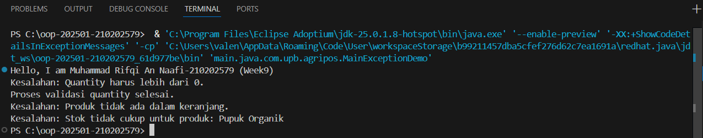

# Laporan Praktikum Minggu 9  
Topik: Exception Handling, Custom Exception, dan Design Pattern (Agri-POS)

## Identitas
- Nama  : Muhammad Rifqi An Naafi  
- NIM   : 210202579  
- Kelas : 3IKKA  

---

## Tujuan
Mahasiswa mampu memahami perbedaan error dan exception, menerapkan try–catch–finally, membuat custom exception, serta mengintegrasikannya dalam sistem keranjang belanja Agri-POS.

---

## Dasar Teori
1. Error adalah kesalahan fatal yang tidak dapat ditangani oleh program.  
2. Exception adalah kesalahan yang masih dapat ditangani menggunakan mekanisme try–catch.  
3. Try–catch digunakan untuk menangani kesalahan saat runtime.  
4. Finally selalu dijalankan baik terjadi exception maupun tidak.  
5. Custom exception dibuat untuk menangani kasus khusus dalam aplikasi.

---

## Langkah Praktikum
1. Membuat package `com.upb.agripos`.  
2. Membuat class `Product` dengan atribut stok.  
3. Membuat custom exception:
   - `InvalidQuantityException`
   - `ProductNotFoundException`
   - `InsufficientStockException`  
4. Mengimplementasikan exception handling pada class `ShoppingCart`.  
5. Menguji program melalui class `MainExceptionDemo`.  
6. Menjalankan program dan menyimpan screenshot hasil.  
7. Melakukan commit dengan pesan:  
   `week9-exception: implement custom exception and validation in shopping cart`

---

## Kode Program
Contoh potongan kode:

```java
try {
    cart.addProduct(p1, -1);
} catch (InvalidQuantityException e) {
    System.out.println("Kesalahan: " + e.getMessage());
}
```

---

## Hasil Eksekusi


---

## Analisis
- Program memvalidasi input quantity menggunakan InvalidQuantityException.
- Program memastikan produk ada di keranjang sebelum dihapus menggunakan ProductNotFoundException.
- Saat checkout, sistem mengecek kecukupan stok dengan InsufficientStockException.
- Blok finally tetap dijalankan untuk memastikan proses validasi selesai.
- Dibandingkan minggu sebelumnya, minggu ini fokus pada keandalan program melalui penanganan kesalahan.

---

## Kesimpulan
Exception handling membuat aplikasi lebih aman dan stabil. Dengan custom exception, kesalahan dapat ditangani secara spesifik sesuai kebutuhan sistem POS seperti validasi jumlah, ketersediaan produk, dan stok.

---

## Quiz
1. Jelaskan perbedaan error dan exception.
Jawaban:
Error adalah kesalahan fatal yang tidak dapat ditangani program, sedangkan exception adalah kesalahan yang masih bisa ditangani menggunakan try–catch.

2. Apa fungsi finally dalam blok try–catch–finally?
Jawaban:
Finally berfungsi untuk mengeksekusi kode yang harus selalu dijalankan, baik terjadi exception maupun tidak.

3. Mengapa custom exception diperlukan?
Jawaban:
Custom exception diperlukan agar kesalahan dapat ditangani secara spesifik sesuai konteks aplikasi, misalnya validasi stok atau quantity.

4. Berikan contoh kasus bisnis dalam POS yang membutuhkan custom exception.
Jawaban:
Contohnya ketika jumlah pembelian melebihi stok yang tersedia, sistem harus menampilkan error menggunakan InsufficientStockException.